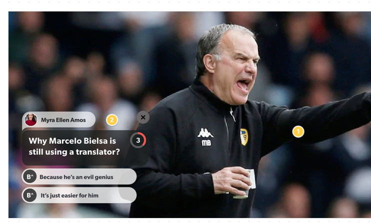

# Buff Android Application and SDK

Android Application and Android Libary using Rest API showing a video and buffs on it.

Both application and SDK written in Kotlin.

## App Architecture
**MVVM** has been selected for application architecture. Project structure is descrived below.

## App
Host Android Application with single activity is playing video from source:

https://buffup-public.s3.eu-west-2.amazonaws.com/video/toronto+nba+cut+3.mp4

This part of project includes:
- **MainActivity** - uses BuffView from SDK to display buffs over video. It observes changes of LiveData<Buff> from MainActivityViewModel and displays new Buff data using BuffView 
- **MainActivityViewModel** - requests buffs every 30 seconds (buffId from 1 to 5) from MainActivityRepository and provides changed buff data to MainActivity
- **MainActivityRepository** - responsible for fetching buff data from BuffClient
- **BuffClient** - uses Retrofit to create BuffApi implementation and provides Buff data to MainActivityRepository
- **BuffApi** - interface with GET method for getting BuffResponse data with Buff as body, which is implemented using Retrofit
- **BuffResponse** - class containing Buff data fetched from REST API
  
## SDK
Contains custom view called BuffView which allows to display buff content.
BuffView displays provided buff data as a question with 2-5 answers which looks like:



This part of project includes:
- **BuffView** - custom view which displays a buff. It must be placed in RelativeLayout or ConstraintLayout. 
  - displays buff with time specified by Buff's timeToShow value and countdown timer showing remaining time. It will hide question if user hasn't selected any answer
  - when user selects an answer it freezes timer and hides buff after 2 seconds
  - closes buff if user clicks on the top right close button 
- **Buff** - data class containing necessary data to display buff. It contains Author, Question and Answer classes
- **InvalidBuffException** - extends Exception and is thrown when provided Buff object contains nullable Author, Question or Answers value or invalid Answers count (must be 2 to 5)
- **InvalidBuffViewParentException** - extends Exception and is thrown when BuffView parent layout is neither RelativeLayout nor ConstraintLayout

## REST API
API Base URL is https://buffup.proxy.beeceptor.com.
App uses GET method with buffId to fetch data for specific buff (buffId 1 to 5)
```
GET /buffs/:buffId
```


## Libraries
- Retrofit2 & OkHttp3 - fetching network data
- GSON - serialization
- Glide - image loading
- LiveData - observable data holder


